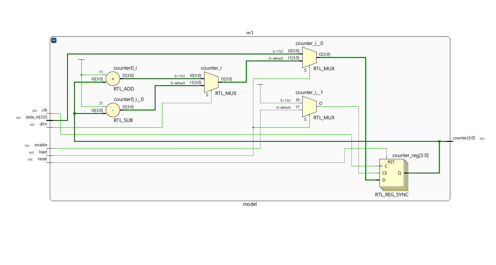
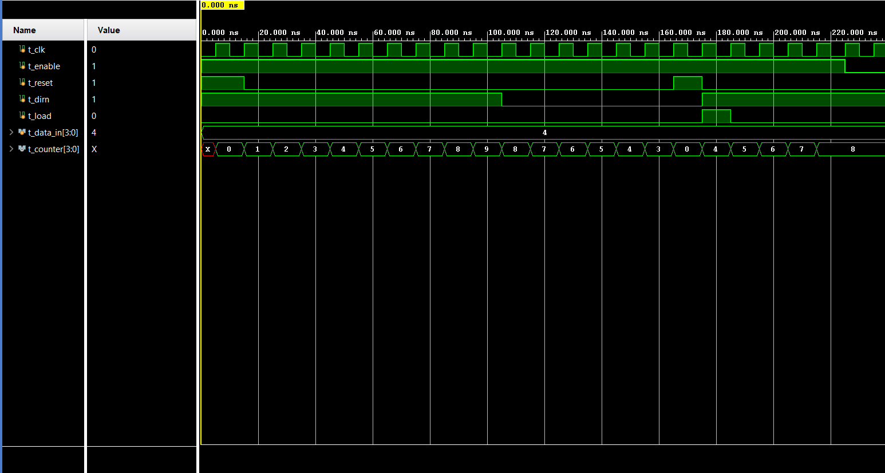

# 4 bit Synchronous Counter 

A 4 bit Synchronous Counter implemented and simulated in AMD Xilinx Vivado

## Operations:
| **Synchronous**| (clk): Every flip-flop inside this module is hooked up to the exact same clock line.|
| **Enable**|If enable = 1, the counter counts. If enable = 0, the counter freezes and holds its current number.|
| **Direction**| Controls the direction. If high, it counts up (0, 1, 2, 3). If low, it counts down (3, 2, 1, 0).|
| **Reset**| If this pin goes high, then on the next clock tick, the counter immediately drops back to 4'b0000.|
| **Load**| If load = 1 , then counter = data_in ignoring clock.|

## Schematic:

## Simulation Waveform:

